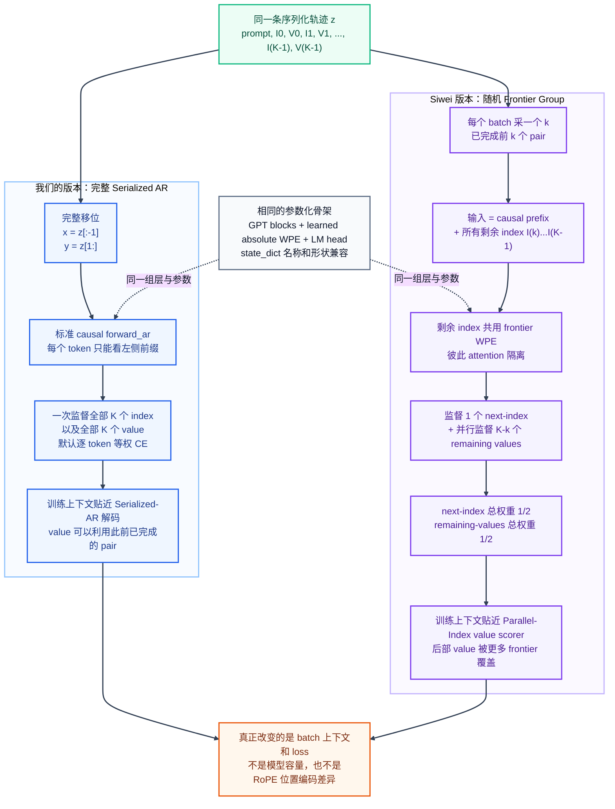

# Ser-FOX Training Objective Comparison

这张图展示两版共享同一参数化 GPT 骨架，但采用不同 batch 上下文和训练目标。

```mermaid
%%{init: {"theme": "base", "themeVariables": {"background": "#ffffff", "primaryTextColor": "#111827", "lineColor": "#334155", "fontFamily": "Arial, Microsoft YaHei, sans-serif"}, "flowchart": {"curve": "basis", "htmlLabels": true}}}%%
flowchart TB
    trajectory["同一条序列化轨迹 z<br/>prompt, I0, V0, I1, V1, ..., I(K-1), V(K-1)"]
    backbone["相同的参数化骨架<br/>GPT blocks + learned absolute WPE + LM head<br/>state_dict 名称和形状兼容"]

    subgraph mine_path["我们的版本：完整 Serialized AR"]
        direction TB
        mine_batch["完整移位<br/>x = z[:-1]<br/>y = z[1:]"]
        mine_forward["标准 causal forward_ar<br/>每个 token 只能看左侧前缀"]
        mine_loss["一次监督全部 K 个 index<br/>以及全部 K 个 value<br/>默认逐 token 等权 CE"]
        mine_bias["训练上下文贴近 Serialized-AR 解码<br/>value 可以利用此前已完成的 pair"]
        mine_batch --> mine_forward --> mine_loss --> mine_bias
    end

    subgraph siwei_path["Siwei 版本：随机 Frontier Group"]
        direction TB
        siwei_sample["每个 batch 采一个 k<br/>已完成前 k 个 pair"]
        siwei_batch["输入 = causal prefix<br/>+ 所有剩余 index I(k)...I(K-1)"]
        siwei_mask["剩余 index 共用 frontier WPE<br/>彼此 attention 隔离"]
        siwei_forward["监督 1 个 next-index<br/>+ 并行监督 K-k 个 remaining values"]
        siwei_loss["next-index 总权重 1/2<br/>remaining-values 总权重 1/2"]
        siwei_bias["训练上下文贴近 Parallel-Index value scorer<br/>后部 value 被更多 frontier 覆盖"]
        siwei_sample --> siwei_batch --> siwei_mask --> siwei_forward --> siwei_loss --> siwei_bias
    end

    conclusion["真正改变的是 batch 上下文和 loss<br/>不是模型容量，也不是<br/>RoPE 位置编码差异"]

    trajectory --> mine_batch
    trajectory --> siwei_sample
    backbone -. "同一组层与参数" .-> mine_forward
    backbone -. "同一组层与参数" .-> siwei_mask
    mine_bias --> conclusion
    siwei_bias --> conclusion

    classDef input fill:#ECFDF5,stroke:#10B981,stroke-width:2px,color:#064E3B;
    classDef common fill:#F8FAFC,stroke:#64748B,stroke-width:2px,color:#0F172A;
    classDef mine fill:#EFF6FF,stroke:#2563EB,stroke-width:2px,color:#1E3A8A;
    classDef siwei fill:#F5F3FF,stroke:#7C3AED,stroke-width:2px,color:#4C1D95;
    classDef output fill:#FFF7ED,stroke:#EA580C,stroke-width:2px,color:#7C2D12;

    class trajectory input;
    class backbone common;
    class mine_batch,mine_forward,mine_loss,mine_bias mine;
    class siwei_sample,siwei_batch,siwei_mask,siwei_forward,siwei_loss,siwei_bias siwei;
    class conclusion output;
    style mine_path fill:#F8FBFF,stroke:#93C5FD,stroke-width:2px
    style siwei_path fill:#FBF9FF,stroke:#C4B5FD,stroke-width:2px
    linkStyle default stroke:#334155,stroke-width:2px;
```
